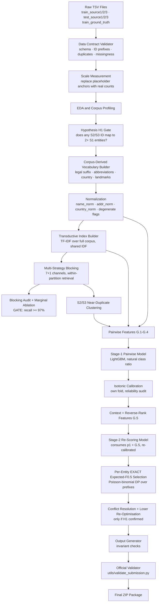

# Business Entity Resolution — Architecture Document v3

**Amazon ML Challenge · Competition-Grade Design**

**Status:** REVISED ARCHITECTURE v3 — corrects 4 critical decision-layer errors, 8 significant defects and 8 moderate issues carried in v2. Awaiting approval before Phase 2 (implementation).

---

## Revision Log (v2 → v3)

### Critical corrections

| # | v2 Defect | Consequence | v3 Fix |
|---|---|---|---|
| C1 | Expected-F₀.₅ formula in I.1 had FP and FN coefficients swapped: `(1.25·TP)/(1.25·TP + 0.25·FP + FN)` | Implements a **recall-weighted** objective — the opposite of the competition metric. Returns 0.909 on the problem statement's worked example, which is stated as 0.714 | Corrected to `(1+β²)TP / ((1+β²)TP + β²·FN + FP)` with β²=0.25. Single shared implementation used by both scorer and decision layer |
| C2 | Empty set scored 0 under the I.1 plug-in formula, because expected_tp = 0 makes the numerator 0 | A singleton could **never** be predicted for any entity with candidates. The v2 claim that "singletons naturally produce empty predictions" was false | Empty-set expectation defined explicitly as ∏(1−pᵢ). Verified: 5 weak candidates (p ≤ 0.12) now correctly yield an empty prediction |
| C3 | Plug-in of expected counts into a non-linear metric described as "Bayes-optimal" | Biased estimator; the claimed 0.8 break-even is not derivable from it or from the true expectation | Replaced with the **exact** expectation over independent Bernoullis via a Poisson-binomial DP. Verified equal to brute force to 8.9e-16 |
| C4 | Claimed neutral include threshold of p > 1/(1+β²) = 0.8 | Not reproducible by any route. Under the exact expectation the isolated break-even is **0.5**; under the v2 plug-in formula it is 0 | Threshold claim removed. The exact formulation produces the correct entity-dependent behaviour without a stated constant |

### Significant corrections

| # | v2 Defect | v3 Fix |
|---|---|---|
| S1 | Three mutually inconsistent splits (J.1 60/20/20, Q.2 60/10/20/10, config summing to 110%) | One canonical split defined once in J.1 and referenced everywhere: 55/15/20/10 |
| S2 | Calibration fold used for both early stopping and isotonic fitting | Separate `earlystop` fold added; calibration fold is fitted on only |
| S3 | "One S2 → at most one S1" asserted as logical necessity | Demoted to **Hypothesis H1**, with a mandatory EDA verification gate (Phase 2.5). Invariant 8 and conflict resolution activate only if H1 is confirmed |
| S4 | "The exchange is always favourable" in conflict resolution | Corrected: favourable in expectation, conditional on ranking accuracy. Margin guard added |
| S5 | Conflict resolution greedy, no re-optimisation of losers | Losing entities' subsets re-optimised after edge removal (single re-selection pass) |
| S6 | G.5 features had no consumer in the decision layer | G.5 now feeds an explicit **Stage-2 re-scoring model** whose output replaces the raw pairwise probability |
| S7 | P.6 proposed collapsing near-duplicate clusters to one representative | Removed. Multi-record matches are legitimate. Clusters are used as a correlation correction, not a collapse |
| S8 | Train/test candidate pool separation undefined | Explicit rule: blocking is run **within-partition**; transductive IDF is shared, candidate retrieval is not |

### Moderate corrections

| # | v2 Defect | v3 Fix |
|---|---|---|
| M1 | Blocks A/B/C near-redundant, never measured | Mandatory marginal-recall ablation for all channels (Exp 1), not just Block H |
| M2 | Volume table said 50–150, audit target said < 100 | Reconciled: single target of ≤ 120 average |
| M3 | Scale anchors were guesses ("typical competition scale") | Marked explicitly as placeholders; Phase 0.5 replaces them with measured counts before any budget claim is relied on |
| M4 | Exp 0 already used expected-F₀.₅, making Exp 6's delta unattributable | Exp 0 uses a fixed p ≥ 0.5 rule; the decision layer is introduced only in Exp 6 |
| M5 | Landmark addresses named in the problem statement, absent from normalization | E.3 landmark-token extraction step added |
| M6 | Missing/empty `business_name` unhandled | Explicit degenerate-record path in E.2 and blocking |
| M7 | P.2's OOD calibration audit not in the experiment plan | Promoted to Exp 8 with a pass/fail gate |
| M8 | Val-B "used once only" contradicted by Rules 3 and 4 | Restated precisely: one scoring event, two decisions derived from it |
| M9 | "Precision weight = 4× recall" vs. the problem statement's "2×" | Footnoted in B rather than silently contradicting the organizers |

---

## Table of Contents

- [A. Problem Interpretation](#a-problem-interpretation)
- [B. Constraints Checklist](#b-constraints-checklist)
- [C. End-to-End Architecture](#c-end-to-end-architecture)
- [D. Data Flow](#d-data-flow)
- [E. Normalization Architecture](#e-normalization-architecture)
- [F. Blocking Architecture](#f-blocking-architecture)
- [G. Feature Architecture](#g-feature-architecture)
- [H. Model Architecture](#h-model-architecture)
- [I. Entity-Level Decision Architecture](#i-entity-level-decision-architecture)
- [J. Validation Architecture](#j-validation-architecture)
- [K. Error Analysis Architecture](#k-error-analysis-architecture)
- [L. Experimentation Plan](#l-experimentation-plan)
- [M. Submission Architecture](#m-submission-architecture)
- [N. Reproducibility Architecture](#n-reproducibility-architecture)
- [O. Risk Register](#o-risk-register)
- [P. Architecture Review (Self-Critique)](#p-architecture-review-self-critique)
- [Q. Public vs. Private Leaderboard Strategy](#q-public-vs-private-leaderboard-strategy)
- [R. Open Questions Requiring Data](#r-open-questions-requiring-data)

---

## A. Problem Interpretation

### A.1 The Task

Given three independently sourced business databases (S1, S2, S3) with no shared identifiers, find for every entity in **Source 1** all records in **Source 2 and/or Source 3** that refer to the same real-world business.

Source 1 is the deduplicated reference source: one row per real-world business. Sources 2 and 3 are noisier mirrors that may contain multiple representations of the same business, or none.

### A.2 Match Cardinality

```
One S1 entity  →  zero, one, or MANY S2/S3 records     CONFIRMED by problem statement
One S2 record  →  at most one S1 entity                 HYPOTHESIS H1 — must be verified
One S3 record  →  at most one S1 entity                 HYPOTHESIS H1 — must be verified
```

**On Hypothesis H1.** The problem statement says Source 1 is deduplicated. It does *not* state that each S2/S3 record represents exactly one business. H1 follows only if that additional premise holds. v2 asserted H1 as a logical necessity; that was an overreach.

H1 is directly testable on the provided training data:

```
Scan train_ground_truth.tsv.
Build reverse map: matched_entity_id -> set of source1_entity_id.
H1 CONFIRMED  if max |set| == 1 across all matched IDs.
H1 REJECTED   if any matched ID appears under two or more S1 rows.
```

This check runs in Phase 2.5 and gates two downstream components:

| If H1 confirmed | If H1 rejected |
|---|---|
| Conflict resolution (I.4) is enabled | Conflict resolution is **disabled** |
| Output Invariant 8 is enforced | Invariant 8 is **removed** |
| Reverse-rank features treated as strong evidence | Reverse-rank features retained as soft evidence only |

Enforcing H1 when it is false would delete true positives. The gate is mandatory.

### A.3 What the Metric Demands

F₀.₅ is computed per S1 entity and then macro-averaged, with singletons included. Three consequences drive the design:

1. **The decision is per-entity.** Each entity's optimal predicted subset depends only on its own candidates' probabilities. There is no globally optimal threshold.
2. **Calibration is load-bearing.** The decision consumes probabilities as numbers, not as a ranking.
3. **The empty prediction is a first-class action** worth a full 1.0 when correct. Any decision rule that cannot output an empty set is structurally broken. This is exactly the defect v2 carried.

### A.4 Noise Patterns (from the problem statement)

- **Names:** abbreviations (Corp/Corporation, Pvt/Private, Ltd/Limited), legal suffix inconsistency, DBA/trade names, punctuation (& vs "and"), word-order transposition, typos
- **Addresses:** abbreviations (Rd/Road, St/Street), transliteration variants, missing components (no PIN, no state), landmark references ("Near SBI ATM"), municipal numbering formats, component reordering

Every one of these maps to a named blocking channel or feature group below. Landmark references, absent from v2, are handled in E.3.

---

## B. Constraints Checklist

### Mandatory output requirements

- [ ] Every test S1 entity appears in `matching_results.tsv` — exactly one row
- [ ] Matched IDs are S2 or S3 only; no self-matches to S1
- [ ] Matched IDs exist in the test source files
- [ ] No duplicate IDs within a single ID list; no duplicate `source1_entity_id` rows
- [ ] Tab-separated output, not comma-separated
- [ ] Empty string (not `NULL`, not `NaN`) for no-match entities
- [ ] `final_matches ⊆ candidates` for every S1 entity
- [ ] France and any other unseen country flow through with no special handling

### Evaluation requirements

- [ ] Metric is F₀.₅ with β = 0.5, macro-averaged per S1 entity
- [ ] Singletons: correct empty prediction = 1.0; any false merge = 0.0
- [ ] Decision layer maximizes **exact expected F₀.₅ per entity**, not a plug-in approximation and not a global threshold
- [ ] The single F₀.₅ implementation is shared between the validation scorer and the decision layer

> **Note on precision weighting.** The problem statement describes F₀.₅ as weighting "precision 2× over recall." In the standard F_β form with β = 0.5, the false-negative term carries β² = 0.25, i.e. a false positive costs 4× a false negative in the denominator. The methodology document should use the organizers' phrasing and footnote the algebra rather than contradict it.

### Prohibited

- ❌ External databases, APIs, entity-resolution services, geocoding APIs, internet lookups
- ❌ External data augmentation of any kind
- ❌ Hard-coding or filtering `country ∈ {US, India}`
- ❌ Ground-truth labels used to derive any feature

### Permitted — transductive use of provided data

The prohibition is on **external** data. The test source files are provided data. Using them for IDF computation, blocking index construction, vocabulary derivation and embedding statistics is permitted and is the correct choice: restricting these to training data creates a gratuitous distribution mismatch, most damaging for France.

**Boundary that must be respected:** transductive statistics are shared; *candidate retrieval is not*. See D.6.

### Model restrictions

- [ ] MIT or Apache 2.0 license only
- [ ] ≤ 8 billion parameters
- [ ] License verified and recorded before any pretrained component is added

---

## C. End-to-End Architecture



Three stages operate on entity-level collections rather than individual pairs: the Stage-2 re-scoring model (N), exact expected-F₀.₅ selection (O), and conflict resolution (P). The G.5 features now have an explicit consumer — the Stage-2 model — which was the missing link in v2.

---

## D. Data Flow

### D.0 Phase 0 — Placeholder Scale Anchors

These figures are **placeholders for planning only**. They are not measured and no design decision may depend on them until Phase 0.5 replaces them.

| Quantity | Placeholder | Status |
|---|---|---|
| S1 entities | 10K–50K | UNVERIFIED |
| S2 + S3 combined | 50K–500K | UNVERIFIED |
| Candidate pairs after blocking | ≤ 120 × \|S1\| | TARGET, not estimate |
| Feature dimension | ~55 (G.1–G.4) | Design-determined |

### D.0.5 Phase 0.5 — Scale Measurement (mandatory before budgeting)

Immediately after ingestion, measure and log: row counts per source and per country; name and address length distributions; null rates; vocabulary sizes for word tokens and character 3-grams; singleton rate in training. Only then compute the runtime and memory budget, and record it in `logs/scale_report.json`.

Design consequences driven by the measured numbers: sparse matrix formats throughout (never a dense N×M allocation); chunked batch retrieval for character n-gram blocks; per-block candidate caps; parallel execution of independent blocking channels.

### D.1 Phase 1 — Ingestion and Contract Validation

Read every file with an explicit `sep="\t"`. Reading a TSV without it silently produces a single column. Assign `source_tag ∈ {S1, S2, S3}` from the file and verify it against the `entity_id` prefix. Assert no duplicate `entity_id` within a source. Log row counts per source and country.

### D.2 Phase 2 — EDA and Corpus Profiling

Across the full corpus (train + test, all sources): high-frequency trailing name tokens per country; high-frequency address tokens per country; distinct country strings; character script distribution; near-duplicate rate within S2, within S3, and across S2↔S3; singleton rate; rate of empty or degenerate names and addresses; rate of landmark markers ("near", "opp", "behind", "beside").

### D.2.5 Phase 2.5 — Hypothesis H1 Gate

Run the reverse-map check in A.2. Record the result in `logs/h1_gate.json` and set `decision.conflict_resolution` and `output.invariant_8` accordingly. **No code downstream may assume H1 without reading this flag.**

### D.3 Phase 3 — Vocabulary Derivation and Normalization

Build vocabularies from the corpus (E.1), then normalize every record (E.2–E.4).

### D.4 Phase 4 — Transductive Index Building

Build four TF-IDF indexes over all S2/S3 records, train and test combined: name word-token, address word-token, name character 3-gram, address character 3-gram. IDF values therefore reflect French tokens, which is the point.

### D.5 Phase 5 — Blocking

Seven channels (plus conditional Block H) run independently and in parallel. Per-block caps applied before union; union deduplicated.

### D.6 Candidate Pool Partition Rule

| Statistic or operation | Scope |
|---|---|
| IDF values, vocabularies, character n-gram space | Full corpus (train + test) — **shared** |
| Candidate retrieval for a **train** S1 entity | Train S2/S3 records only |
| Candidate retrieval for a **test** S1 entity | Test S2/S3 records only |

Retrieval must never cross the train/test partition. A test S2 record retrieved for a training S1 entity has no label and would be silently treated as a negative, injecting label noise proportional to the test set size. v2 left this undefined.

### D.7 Phase 6 — Blocking Audit (Gate)

Measure blocking recall on the validation families, plus the marginal contribution of each channel. Gate: ≥ 97% recall overall, per source, and per country. **Do not proceed to feature engineering until this passes.**

### D.8 Phase 7 — Near-Duplicate Clustering

Cluster S2 and S3 records that are near-identical to each other. Used for correlation correction in the decision layer (P.6) and for G.5 cluster features — **not** to collapse candidates.

### D.9 Phases 8–13

Feature computation (G.1–G.4) → Stage-1 model training and calibration → scoring → G.5 second pass → Stage-2 re-scoring and re-calibration → exact expected-F₀.₅ selection → conflict resolution (conditional) → output generation → validation gate.

---

## E. Normalization Architecture

All vocabularies are **derived from the full corpus**, never hand-coded. This is the only approach that handles an open country set.

### E.1 Vocabulary Derivation

**Legal suffix vocabulary.** For every record, extract the final one or two tokens of `business_name`. Compute frequency per token grouped by `country_norm`. Tokens above a frequency threshold become candidates. A one-time review of the top 50 per country produces `configs/legal_suffix_map.yaml`.

This discovers whatever is actually present in the data — English forms (`ltd → limited`, `pvt → private`, `corp → corporation`, `inc → incorporated`), French forms if France uses them (`sarl`, `sas`, `sa`, `eurl`, `sasu`), Indian variants, and anything unanticipated. No form is assumed in advance.

**Address abbreviation vocabulary.** Same algorithm over address tokens, grouped by country.

**Country map.** Enumerate all distinct country strings in the corpus; map each to a canonical lowercase form. Missing or empty → `"unknown"`, treated as a valid value.

**Landmark marker vocabulary (new in v3).** Mine high-frequency address prefixes that indicate a relative reference: "near", "opp", "opposite", "behind", "beside", "next to", "above", "in front of". Derived from the corpus, not assumed.

### E.2 Business Name Normalization

1. Unicode NFC normalization
2. Script detection — flag Latin, Devanagari, other; record as metadata
3. Lowercase
4. Punctuation normalization — `&` → `and`; normalize apostrophes; **preserve hyphens** in compound names; strip trailing periods
5. Whitespace collapse
6. Legal suffix normalization using the corpus-derived map — **keep** the canonical suffix in the token set; never delete it ("limited" ≠ "unlimited")
7. DBA / trade-name split — detect "DBA", "d/b/a", "T/A", "TA", "Trading As", "formerly"; retain **both** the primary and trade name representations
8. Controlled abbreviation expansion — corpus-derived map, high-confidence single tokens only
9. Token extraction → `name_tokens`; sorted variant → `name_tokens_sorted`
10. Character 3-grams → `name_chars`
11. Metadata: `name_token_count`, `name_char_len`

**Degenerate records (new in v3).** If `business_name` is empty, whitespace-only, or reduces to a legal suffix alone after normalization, set `name_is_degenerate = True`. Such records are excluded from name-based blocking channels (A, B, C, F, H) — they would match indiscriminately — but remain eligible for address-based channels (D, E, G). The flag is also a model feature.

**Normalization must never make two genuinely different businesses identical.** Monitor collision rate during EDA: count distinct raw names collapsing to each `name_norm`. Investigate any collision group above a small threshold.

### E.3 Address Normalization

1. Unicode NFC
2. Script detection
3. Lowercase
4. Punctuation normalization
5. **Landmark extraction (new in v3)** — detect a corpus-derived landmark marker, split the address into `addr_core` and `addr_landmark`. Both retained. Landmark text is matched separately from core address text, because "near SBI ATM" and "12 MG Road" are different kinds of evidence and mixing them dilutes both
6. Corpus-derived abbreviation normalization
7. Numeric extraction — house numbers, postal codes → `addr_numbers`
8. Postal code normalization — strip whitespace; missing → empty string; **no length assumption** is hard-coded (digit-count patterns are observed per country, used as features, never as filters)
9. Whitespace collapse
10. Token extraction → `addr_tokens`; numeric isolation → `addr_numeric_tokens`
11. Character 3-grams → `addr_chars`
12. Metadata: `addr_token_count`, `addr_char_len`, `addr_has_numeric`, `addr_has_landmark`, `addr_is_degenerate`

Do not geocode. Do not call external APIs. Do not fail on missing components.

### E.4 Country Normalization

Apply `configs/country_map.yaml`. Missing → `"unknown"`. Never hard-code the permitted value set. Country is an input feature with a learned weight, never a hard filter.

---

## F. Blocking Architecture

Blocking recall is a hard ceiling on final recall: a true match never generated as a candidate cannot be recovered by any downstream model.

### F.1 Channel Redundancy Must Be Measured

Blocks A, B and C all require a shared **name token** — A adds a country filter, C restricts to high-IDF tokens, B is the permissive superset. Blocks D and G both operate on addresses. They may be substantially redundant. v2 assumed complementarity and measured it only for Block H.

**v3 requirement:** compute the *marginal* recall contribution of every channel, defined as recall(all channels) − recall(all channels except X), during Exp 1. Any channel contributing < 0.5 pp marginal recall is removed. This applies to all channels without exception.

### F.2 Channel Specifications

| Block | Signal | Cap per S1 | Rank-before-cap key |
|---|---|---|---|
| A | country + shared name token | 200 | shared-token IDF sum |
| B | shared name token, any country | 200 | shared-token IDF sum |
| C | shared top-3 high-IDF name token | 100 | token IDF |
| D | shared non-generic address token (df < 3%) | 100 | shared-token IDF sum |
| E | shared postal code / dominant numeric | 50 | exact match, then name similarity |
| F | name char-3-gram TF-IDF cosine ≥ 0.15 | 50 | cosine |
| G | address char-3-gram TF-IDF cosine ≥ 0.15 | 50 | cosine |
| H | phonetic code (conditional) | 50 | number of matching codes |

**Block B token filter:** exclude tokens with document frequency > 5% of the corpus. **Block D:** exclude tokens with document frequency > 3%.

**Block H condition:** included only if it adds ≥ 1 pp marginal blocking recall in the Exp 1 ablation. Its phonetic encoders are English-centric and unlikely to serve French or Hindi well; Block F already covers much of the same ground at the character level.

**Degenerate-name records** are skipped by A, B, C, F, H. **Degenerate-address records** are skipped by D, E, G. A record degenerate in both fields yields no candidates and is predicted as a singleton, which is the correct conservative behaviour.

### F.3 Audit Metrics and Gate

| Metric | Target | Action if missed |
|---|---|---|
| Blocking recall, overall | ≥ 97% | Add or tune channels; do not proceed |
| Blocking recall, per source (S2, S3) | ≥ 97% | Source-specific audit |
| Blocking recall, per country | ≥ 97% | Country-specific tuning |
| Marginal recall per channel | ≥ 0.5 pp | Remove the channel |
| Average candidates per S1 | ≤ 120 | Tighten caps or IDF filters |
| Maximum candidates per S1 | ≤ 500 | Hard cap; flag the entity |
| Reduction ratio | report and monitor | Investigate bloated channels |

The single average target of 120 replaces v2's conflicting "50–150" and "< 100". The reduction ratio is reported rather than given an invented target, since the organizers analyse it and its achievable value depends on measured corpus size.

---

## G. Feature Architecture

**Strict staging.** G.1–G.4 are Stage-1 pairwise features, computed before any model runs. G.5 features depend on model scores and are computed in a second pass; they feed the Stage-2 model only. No G.5 feature may enter Stage-1 training — that would be circular.

### G.1 Name Features

| Feature | Description |
|---|---|
| `name_exact_norm` | Binary: `name_norm` identical |
| `name_token_jaccard` | Jaccard of token sets |
| `name_token_jaccard_sorted` | Jaccard of sorted token sets |
| `name_weighted_token_jaccard` | IDF-weighted Jaccard (transductive IDF) |
| `name_char3_jaccard` | Jaccard of character 3-gram sets |
| `name_levenshtein_norm` | Normalized edit distance |
| `name_tfidf_cosine` | Word-token TF-IDF cosine |
| `name_char_tfidf_cosine` | Character 3-gram TF-IDF cosine |
| `name_token_containment_fwd` | Fraction of S1 tokens present in candidate |
| `name_token_containment_bwd` | Fraction of candidate tokens present in S1 |
| `name_token_sort_levenshtein` | Edit distance on token-sorted strings |
| `name_len_ratio` | min/max character length |
| `name_token_count_ratio` | min/max token count |
| `name_rare_token_overlap_count` | Shared tokens with IDF above the 90th percentile |
| `name_rare_token_overlap_jaccard` | Jaccard restricted to rare tokens |
| `name_legal_suffix_match` | Binary: canonical suffix identical |
| `name_legal_suffix_both_present` | Binary: both carry a canonical suffix |
| `name_common_prefix_len_norm` | Normalized longest common prefix |
| `name_initialism_possible` | Binary: initials of one match full tokens of the other |
| `name_dba_variant_match` | Binary: either representation of one matches either of the other |
| `name_either_degenerate` | Binary: at least one name is degenerate |

### G.2 Address Features

| Feature | Description |
|---|---|
| `addr_exact_norm` | Binary: exact match on `addr_norm` |
| `addr_token_jaccard` | Token-level Jaccard |
| `addr_char3_jaccard` | Character 3-gram Jaccard |
| `addr_levenshtein_norm` | Normalized edit distance |
| `addr_tfidf_cosine` | Word-token TF-IDF cosine |
| `addr_char_tfidf_cosine` | Character 3-gram TF-IDF cosine |
| `addr_token_containment_fwd` / `_bwd` | Directional token containment |
| `addr_numeric_jaccard` | Jaccard of numeric tokens |
| `addr_postal_match` | Binary: postal codes match, both present |
| `addr_postal_both_present` | Binary |
| `addr_house_number_match` | Binary: dominant house number matches |
| `addr_core_tfidf_cosine` | Cosine on `addr_core` only, landmark stripped |
| `addr_landmark_jaccard` | Token Jaccard on `addr_landmark` only |
| `addr_landmark_both_present` | Binary |
| `addr_len_ratio`, `addr_token_count_ratio` | Length and count ratios |
| `addr_rare_token_overlap_count` | Shared rare address tokens |
| `addr_both_missing`, `addr_one_missing` | Missingness indicators |

### G.3 Country Features

`country_exact_match`, `country_s1_known`, `country_cand_known`, `country_both_known`, `country_both_missing`. Evidence with learned weights; never hard filters.

### G.4 Cross-Field Features

`name_strong_addr_strong`, `name_strong_addr_weak`, `name_weak_addr_strong` (the DBA pattern), `name_weak_addr_weak`, `name_x_addr_cosine`, `country_x_name_jaccard`, `max_name_sim`, `max_addr_sim`, `harmonic_name_addr`, `name_jaccard_x_addr_jaccard`.

Threshold constants inside the binary cross-field features are configuration values, tuned on validation, never hard-coded in source.

### G.5 Second-Pass Features — consumed by the Stage-2 model

**Reverse-rank / competition features**

| Feature | Description |
|---|---|
| `n_s1_claimants` | Distinct S1 entities holding this candidate |
| `reverse_rank_of_cand` | Rank of this S1 among claimants, by score |
| `is_mutual_best_match` | Binary: mutual top choice |
| `max_competing_score` | Highest score among other claimants |
| `score_lead_over_competitor` | This score minus `max_competing_score` |

**Within-entity context features**

`candidate_count_for_s1`, `score_rank_within_s1`, `score_percentile_within_s1`, `score_margin_to_second`, `score_z_within_s1`.

**Cluster-consistency features**

`cand_in_near_dup_cluster`, `cluster_size`, `cluster_s1_claimant_count`, `cluster_max_score_for_s1`, `cluster_mean_score_for_s1`.

If H1 is rejected at the Phase 2.5 gate, the reverse-rank features are retained but their interpretation changes: multiple claimants become merely informative rather than evidence of an error.

---

## H. Model Architecture

### H.1 Principle

Start simple; measure on a stable negative distribution (full blocking active from Exp 1); add complexity only when validation F₀.₅ improves and precision does not degrade.

### H.2 Class Imbalance

**No `scale_pos_weight`, no `class_weight`.** Upweighting positives shifts the decision boundary toward recall and corrupts calibration — both wrong when the decision layer consumes calibrated probabilities.

Single exception: if the positive rate is so extreme that training numerically collapses to an all-negative predictor, apply mild negative *undersampling* (target ≈ 1:20) as a stability measure, then **correct the calibration for the sampling rate** using the known prior-shift adjustment. Undersampling without this correction reintroduces exactly the bias it was meant to avoid.

### H.3 Stage-1 Baseline — Logistic Regression

Establishes a floor and diagnoses the feature set. Naturally well-calibrated. scikit-learn, BSD-3-Clause.

> **License note.** The constraint names "MIT/Apache 2.0" for the *final model*. The final model here is LightGBM (MIT). scikit-learn is BSD-3-Clause, which is permissive and compatible in practice but is not literally MIT or Apache 2.0; it is used for the logistic-regression baseline, isotonic calibration and TF-IDF vectorizers. State this explicitly in the methodology document rather than describing BSD as "Apache-compatible" and leaving a reviewer to decide. If any doubt is raised, the LR baseline is droppable and calibration can be reimplemented in NumPy.

### H.4 Stage-1 Primary — LightGBM

MIT licensed. Settings: `class_weight=None`; `learning_rate=0.05`; `num_leaves` swept over 31/63/127; `min_child_samples` tuned; `n_estimators` selected by early stopping **on the dedicated `earlystop` fold** — not on the calibration fold. Alternatives with acceptable licenses: XGBoost (Apache 2.0), CatBoost (Apache 2.0).

### H.5 Calibration — mandatory, on its own fold

Isotonic regression fitted on the calibration fold, which is used for nothing else. v2 fitted early stopping and calibration on the same data, making the calibrator optimistic about a model that had already been selected to fit it.

**Audit:** reliability diagram, actual positive rate per predicted-probability decile, plus Expected Calibration Error. Accept when approximately diagonal. If not, enlarge the calibration fold or investigate Stage-1 underfitting. The decision layer's correctness depends entirely on this.

### H.6 Stage-2 Re-Scoring Model (new in v3 — resolves the G.5 orphan)

**Input:** the Stage-1 calibrated probability plus all G.5 features.
**Output:** a revised probability `p₂(match | pair, entity context)`.
**Model:** a small LightGBM, deliberately low-capacity (shallow, few leaves) to limit overfitting on a feature set dominated by rank statistics.
**Calibration:** re-calibrated on the same calibration fold, since the Stage-2 output is what the decision layer consumes.
**Training data:** scores must come from out-of-fold predictions. Using in-fold Stage-1 scores would make G.5 rank features reflect a model that has memorised its training pairs.

If Exp 7 shows no improvement, Stage 2 is dropped and `p₂ := p₁`. The pipeline must run correctly either way.

### H.7 Conditional — Multilingual Embedding Features

Included only if error analysis after Exp 7 attributes ≥ 0.5 pp of headroom to semantic name failures. Preferred: `intfloat/multilingual-e5-small` (MIT, ~118M parameters), used as an additional similarity feature into Stage-1 — never as a standalone matcher.

---

## I. Entity-Level Decision Architecture

### I.1 The Correct Objective — verified

For each S1 entity independently, given calibrated probabilities p₁…pₙ for its n candidates, choose the subset S maximizing the **exact expected F₀.₅**.

Per-entity F₀.₅ with β = 0.5:

$$F_{0.5} = \frac{(1+\beta^2)\,TP}{(1+\beta^2)\,TP + \beta^2\,FN + FP}, \qquad \beta^2 = 0.25$$

so

$$F_{0.5} = \frac{1.25\,TP}{1.25\,TP + 0.25\,FN + FP}$$

**β² multiplies FN. FP carries coefficient 1.** v2 had these reversed, which inverted the metric into a recall-weighted objective. Verification against the problem statement's worked example (TP = 2, FP = 1, FN = 0): the correct formula returns **0.7143**, matching the stated 0.714; the v2 formula returns 0.9091.

### I.2 Exact Expectation, Not Plug-In

Because F₀.₅ is non-linear in the counts, `E[F(TP, FP, FN)] ≠ F(E[TP], E[FP], E[FN])`. v2 plugged expected counts into the metric and called the result Bayes-optimal; it is a biased approximation.

Treating candidate labels as independent Bernoulli variables:

```
Let S      = selected subset, k = |S|
    TP     ~ PoissonBinomial({p_i : i in S})
    FP     = k - TP
    FN     ~ PoissonBinomial({p_j : j not in S})          independent of TP

E[F] = SUM over tp, fn of  P(TP=tp) * P(FN=fn) * F05(tp, k-tp, fn)
```

Both PMFs are computed by a standard O(m²) dynamic program. **Verified: this DP matches brute-force enumeration over all 2ⁿ truth assignments to within 8.9e-16.**

### I.3 The Empty Set — the defect that mattered most

The empty prediction must be scored explicitly:

```
E[F(empty set)] = P(no candidate is a true match) = PRODUCT over all i of (1 - p_i)
```

This follows from the scoring rule: predicting empty earns 1.0 when the entity is a true singleton and 0.0 otherwise.

**Known bias (new in v3).** This expression conditions on the candidate set: it is P(no *candidate* is a true match), not P(the entity is a true singleton). If blocking missed a true match, the entity is not a singleton even when every candidate is a non-match, and the empty prediction scores 0.0 rather than 1.0. At the 97% blocking-recall gate the empty-set value is therefore optimistic by up to ~0.03 in the worst case. The same omission shrinks expected FN for non-empty subsets, so the bias is partially self-cancelling across options — but it does tilt marginally toward predicting empty. Two consequences: the blocking recall gate is load-bearing for *decision quality*, not only for the recall ceiling; and a blocking-miss correction factor `(1 − r̂)`, with `r̂` the measured per-country blocking recall, should be evaluated as an Exp 6 ablation.

Under v2's formula, `expected_tp = 0` for the empty set forced the numerator to 0, so the empty set could never win. Every entity with any candidate would receive at least one prediction. Given that a false merge on a true singleton scores 0.0 while a correct empty prediction scores 1.0, this alone could have dominated the macro-average.

**Verified behaviour after the fix** — an entity with five weak candidates (p = 0.12, 0.10, 0.08, 0.06, 0.05):

| Formulation | Chosen subset | Score |
|---|---|---|
| v3 exact expectation | **empty** (correct) | 0.6507 |
| v2 formula | top three candidates | 0.3233 |

### I.4 Break-Even Behaviour

For a single isolated candidate, include yields E[F] = p and exclude yields 1 − p, so the break-even is **p = 0.5**, not the 0.8 asserted in v2. Verified across p ∈ {0.2, 0.4, 0.5, 0.6, 0.8, 0.9}: exclude wins below 0.5, include wins above.

With several candidates the effective inclusion point shifts, because adding a candidate simultaneously raises expected TP and lowers expected FN. This is precisely why no single constant is correct and why the decision must be computed per entity. v3 states no fixed threshold anywhere.

### I.5 Search Strategy

**Claim:** the optimal subset is a prefix of the candidates sorted by p descending.

**Evidence:** 3,000 randomised trials over entities with 1–7 candidates found **0 violations** against exhaustive search over all 2ⁿ subsets. Treated as a strong empirical result, not a proof; the prefix restriction is a configuration flag so exhaustive search can be enabled for small n if a counterexample ever appears.

```
select_matches(candidate_probs):
    p_sorted = sort(candidate_probs, descending)
    p_sorted = truncate(p_sorted, top_M)          # M = 20, configurable
    best_k, best_val = 0, PRODUCT(1 - p_i)        # empty set
    for k in 1..len(p_sorted):
        val = exact_expected_f05(prefix_k)         # Poisson-binomial DP
        if val > best_val: best_k, best_val = k, val
    return p_sorted[:best_k]                       # possibly empty
```

**Complexity and pruning.** Evaluating all prefixes with the DP is O(n³) in the worst case, which is too slow at scale in pure Python for wide candidate lists. Two mitigations, both verified:

- Drop candidates with p < 0.01 before selection. Across 300 randomised trials this changed the selected prefix length in **1 case out of 300**, and only by including a candidate of negligible probability.
- Truncate to the top M = 20 by probability. Selecting more than 20 matches for one S1 entity is implausible; if it occurs, the entity is flagged for review rather than silently truncated.

After pruning, effective n is typically in the single digits and selection cost is negligible.

### I.6 Multiple Matches

No one-to-one constraint is imposed in the S1 → S2/S3 direction. The formulation selects several candidates whenever the calibrated probabilities support it, which is required because an S1 entity may legitimately match several S2 **and** several S3 records.

### I.7 Correlated Candidates

The independence assumption is violated when two S2 records are near-duplicates of each other: their labels are strongly positively correlated, and the DP over-counts the spread of TP.

**v3 handling:** near-duplicate cluster members are **not** collapsed — that would suppress legitimate multi-record matches, which was the error in v2's P.6. Instead, cluster membership enters the Stage-2 model through the G.5 cluster features, letting the model adjust p₂ for members of the same cluster before the independence-based DP consumes them. The residual approximation is documented as a known limitation in P.6.

### I.8 Conflict Resolution — conditional on H1

**Runs only if the Phase 2.5 gate confirms H1.**

```
Build reverse index: candidate_id -> [(s1_id, p2), ...] over PREDICTED edges only

for each candidate_id with more than one claimant:
    winner = claimant with highest p2
    runner_up = second highest p2
    if (p2(winner) - p2(runner_up)) < margin_delta:
        # too close to call: drop the edge for ALL claimants
        remove edge from every claimant          # precision-protective
    else:
        remove edge from every claimant except winner
    log conflict_event(candidate_id, winner, losers, scores, action)

# Loser re-optimisation (new in v3)
for each s1 that lost at least one edge:
    re-run select_matches() on its remaining candidates
```

**Why the margin guard.** v2 stated the exchange is "always favourable." It is not. Keeping the highest-scoring claimant is favourable *in expectation and conditional on ranking accuracy*; when the ranking is wrong, the pass deletes a true positive and retains a false one, losing on both precision and recall. When two claims are near-indistinguishable, dropping both is the precision-correct action under F₀.₅.

**Why re-optimisation.** An entity's optimal subset was computed over its full candidate set. Removing one candidate changes that entity's expected-F₀.₅ landscape, so the subset must be recomputed. v2 left losers with a stale selection.

`margin_delta` is tuned on validation like any other parameter.

---

## J. Validation Architecture

### J.1 The Canonical Split — defined once

v2 specified three incompatible splits across J.1, Q.2 and the config, one summing to 110%. This is the single authoritative definition; all code and config reference it.

```
All TRAINING S1 families, stratified by (country_norm, is_singleton, match_source_pattern)

  45%  ->  train         Stage-1 and Stage-2 model fitting
  15%  ->  earlystop     early stopping / hyperparameter selection ONLY
  10%  ->  calibration   isotonic fitting ONLY — used for nothing else
  20%  ->  val-A         iterative experiment comparison (used many times)
  10%  ->  val-B         final honest estimate (scored exactly once)
                         ---
                         100%
```

Four named folds, four disjoint purposes. `calibration` is a first-class fold, not a derived one.

> **Correction applied.** An earlier draft of v3 listed only four folds (55/15/20/10) while Sections H.5, H.6 and the config all referenced "the calibration fold" by name — the same class of naming divergence v3 was written to eliminate. Calibration is now an explicit 10% fold and `train` drops to 45%.

**Splitting unit.** Families, not records: an S1 entity together with all its matched S2/S3 records. Splitting records would place a true match in a different fold from its S1 entity.

**Candidate pool.** The **full** S2/S3 corpus of the same partition remains available to every fold. Only the ground-truth **labels** of held-out families are withheld. v2's ancestor withheld the records themselves, which made blocking recall structurally zero; v2 fixed it and v3 preserves the fix.

### J.2 F₀.₅ Implementation — single shared source of truth

```python
BETA2 = 0.25  # beta = 0.5

def f05_per_entity(predicted: set, true: set) -> float:
    if not true and not predicted:
        return 1.0                      # correct singleton
    if not true and predicted:
        return 0.0                      # false merge on a singleton
    if not predicted:
        return 0.0                      # missed everything
    tp = len(predicted & true)
    fp = len(predicted) - tp
    fn = len(true) - tp
    num = (1 + BETA2) * tp
    den = (1 + BETA2) * tp + BETA2 * fn + fp
    return num / den if den > 0 else 0.0

f05_macro = mean(f05_per_entity(pred_i, true_i) for i in evaluation_entities)
```

**This function is imported by both the validation scorer and the decision layer.** v2 had a correct implementation in J.2 and an incorrect one in I.1; a single definition makes that class of divergence impossible.

### J.3 Validation Dashboard

| Metric | Priority |
|---|---|
| F₀.₅ macro | P0 |
| Precision macro | P0 |
| Blocking recall (gate) | P0 |
| Singleton accuracy — correct empties / true singletons | P0 |
| False merge rate — false merges / true singletons | P0 |
| Calibration ECE and reliability diagram | P0 |
| Recall macro | P1 |
| Conflict resolution event count and outcomes | P1 |
| Per-country F₀.₅ (US, India) | P1 |
| S2 F₀.₅ / S3 F₀.₅ | P1 |
| Mean and max candidates per S1 | P2 |
| Reduction ratio | P2 |
| Empty-prediction rate vs. true singleton rate | P0 |

The last metric is a direct regression test for the C2 defect: if the empty-prediction rate is near zero while the true singleton rate is not, the decision layer is broken again.

### J.4 Anti-Leakage Checklist

- [ ] No ground-truth label used in computing any feature
- [ ] Held-out family S2/S3 **records** are in the candidate pool; only their labels are withheld
- [ ] Blocking retrieval never crosses the train/test partition (D.6)
- [ ] IDF and vocabularies computed transductively over the corpus — permitted; documented in the methodology write-up
- [ ] Early stopping and calibration use different data
- [ ] G.5 features computed from out-of-fold Stage-1 scores
- [ ] val-A never used to fit any parameter, only to compare configurations
- [ ] val-B scored exactly once

---

## K. Error Analysis Architecture

### K.1 False Positive Categories

| Category | Fix target |
|---|---|
| Common-name collision | IDF weighting; Block C; require both fields strong |
| Address collision (shared building) | Name must also agree; address-token IDF |
| Franchise / branch confusion | Address must disagree; numeric and house-number features |
| Transliteration collapse | Over-aggressive normalization; review collision monitor |
| Calibration overestimate | p₂ too high in a probability band; check reliability diagram |
| Conflict resolution error | Audit the conflict event log; check whether the margin guard fired |

### K.2 False Negative Categories

| Category | Fix target |
|---|---|
| DBA / trade name | Block D must catch it; `name_weak_addr_strong` |
| Severe abbreviation | Block F character n-grams |
| Missing address | Name features must carry the pair; missingness indicators |
| Transliteration mismatch | Blocks F and H; character n-gram features |
| Blocking miss | Identify and fix the responsible channel |
| Calibration underestimate | p₂ too low → the exact expectation correctly excludes a true match |
| Conflict resolution over-removal | Margin guard too wide, or H1 wrongly assumed |

### K.3 Singleton Error Analysis

Two directions, tracked separately because they have different costs:

- **False merge on a true singleton** — 0.0 for that entity. Check the calibrated probabilities of the selected candidates and the reliability diagram in that band. If probabilities are accurate, the exact expectation would not have selected them, so the fault is calibration, not the decision rule.
- **Missed match on a true non-singleton** — was the match generated as a candidate? If no: blocking. If yes: model or calibration.

### K.4 Loop

```
Train -> score val-A -> full dashboard
  -> categorise FPs, FNs, singleton errors
  -> implement one targeted fix
  -> retrain -> compare
  -> accept only if F0.5 improves AND precision does not degrade materially
```

---

## L. Experimentation Plan

Every experiment is a committed configuration, never an ad-hoc edit, and is compared against the current best on the full dashboard.

### Exp 0 — Pipeline Verification

Block B only, basic normalization, three features, logistic regression, and a **fixed p ≥ 0.5 decision rule**. Success criterion is only that the pipeline runs end-to-end and the outputs pass `validate_submission.py`.

The fixed rule is deliberate: v2 used expected-F₀.₅ selection at Exp 0, so the later decision-layer experiment had nothing clean to measure against.

### Exp 1 — Full Normalization + Full Blocking (GATE)

Full normalization including corpus-derived vocabularies; all channels; blocking recall audit **and the per-channel marginal ablation**. Gate: ≥ 97% recall overall, per source, per country. Channels below 0.5 pp marginal recall are removed here. No feature experiment starts until this passes, so all later experiments share one stable negative distribution.

### Exp 2 — Name Features (G.1)
### Exp 3 — Address Features (G.2), including landmark-aware features
### Exp 4 — Country and Cross-Field Features (G.3, G.4)

### Exp 5 — LightGBM Upgrade

Replace LR. No class weighting. Early stopping on the `earlystop` fold.

### Exp 6 — Calibration + Exact Expected-F₀.₅ Decision Layer

The most consequential single experiment, and now cleanly attributable because Exp 0–5 used a fixed threshold. Adds isotonic calibration and per-entity exact expected-F₀.₅ selection.

**Regression checks that must pass:** the empty-prediction rate is of the same order as the true singleton rate; the F₀.₅ implementation used by the decision layer is the same import as the scorer; singleton accuracy improves against Exp 5.

### Exp 7 — G.5 Features + Stage-2 Re-Scoring + Conflict Resolution

Adds the second-pass features, the Stage-2 model, and — if H1 was confirmed — conflict resolution with the margin guard and loser re-optimisation. Report the conflict event count and the outcome split. Drop Stage 2 if it does not improve F₀.₅.

### Exp 8 — Out-of-Distribution Calibration Audit (promoted from P.2)

Hold India out of calibration entirely; calibrate on US only; measure calibration quality and F₀.₅ on India. This is the only available proxy for how calibration will behave on France.

**Gate:** if F₀.₅ on held-out India degrades by more than 2 pp relative to in-distribution calibration, the decision layer is too calibration-sensitive for an unseen country. Fall back to a country-agnostic calibrator or a more conservative selection rule, and document the decision.

### Exp 9 — Embedding Features (conditional)

Only if Exp 7 error analysis attributes ≥ 0.5 pp of headroom to semantic name failures. `intfloat/multilingual-e5-small`, MIT, ~118M parameters, as a feature source into Stage-1.

### Exp 10 — Final Ensemble and Honest Estimate

LightGBM ensemble over 5 seeds with averaged calibrated probabilities, re-calibrated after averaging. Then score **val-B once**. See Section Q.

---

## M. Submission Architecture

### M.1 Output Invariants

1. **Coverage** — every test S1 ID appears exactly once in `matching_results.tsv`
2. **ID validity** — every matched ID exists in `test_source2.tsv` ∪ `test_source3.tsv`
3. **Uniqueness** — no duplicate ID within a list; no duplicate S1 row
4. **Subset** — `matching_results` IDs ⊆ `candidate_pairs` IDs, per entity
5. **Format** — tab-separated; ID lists comma-separated with no quoting
6. **Null representation** — empty string, not `NaN`, not `NULL`
7. **Header** — present in both files with exact column names
8. **Conflict** (conditional) — no S2/S3 ID appears under more than one S1 row

**Invariant 8 is enforced only if the Phase 2.5 gate confirmed H1.** The official validator does not require it, and enforcing it against a false premise would delete true positives.

### M.2 Candidate File Semantics

`candidate_pairs.tsv` must be the **last** candidate set — exactly the pairs the matching model ran inference over, not the raw output of an early blocking pass that was later filtered. Concretely: the deduplicated post-cap union that entered feature computation. Every ID in `matching_results.tsv` must appear here.

### M.3 Validation Gate

```
write candidate_pairs.tsv and matching_results.tsv
  -> internal invariant checker (all applicable invariants, hard assertions)
       any failure: log detail, HALT
  -> python3 utils/validate_submission.py \
         --matching output/matching_results.tsv \
         --candidate output/candidate_pairs.tsv \
         --test-dir dataset/test
       non-zero exit: log, HALT
  -> PASS -> package ZIP
```

Never bypass this gate.

### M.4 Package Layout

```
<team_name>_submission.zip
├── output/
│   ├── matching_results.tsv
│   └── candidate_pairs.tsv
├── code/
│   └── business_entity_resolution/
│       ├── src/
│       │   ├── config.py
│       │   ├── data_loader.py
│       │   ├── h1_gate.py                 # hypothesis verification
│       │   ├── vocab_builder.py           # corpus-derived vocabularies
│       │   ├── normalizer.py
│       │   ├── index_builder.py           # transductive TF-IDF
│       │   ├── blocker.py                 # channels + union + dedup + ablation
│       │   ├── clusterer.py               # S2/S3 near-duplicate clusters
│       │   ├── feature_engineer.py        # G.1-G.4
│       │   ├── model.py                   # Stage-1 + calibration
│       │   ├── context_features.py        # G.5 second pass
│       │   ├── stage2_model.py            # re-scoring
│       │   ├── metrics.py                 # SINGLE F0.5 implementation
│       │   ├── decision_engine.py         # exact expected-F0.5 + conflict
│       │   ├── output_generator.py
│       │   ├── validator.py
│       │   └── pipeline.py
│       ├── configs/
│       │   ├── config.yaml
│       │   ├── legal_suffix_map.yaml      # corpus-derived
│       │   ├── abbreviation_map.yaml      # corpus-derived
│       │   ├── country_map.yaml           # corpus-derived
│       │   └── landmark_markers.yaml      # corpus-derived
│       ├── tests/
│       ├── README.md
│       └── requirements.txt
└── Documentation_template.md
```

**Project layout aligned to the official validator.** The problem statement specifies that the validator is run *from the `student_resource/` directory*, with paths relative to it. The working layout must therefore be:

```
student_resource/                 <- run the validator from HERE
├── dataset/
│   ├── train/
│   └── test/          <- validate_submission.py --test-dir dataset/test
├── output/
├── utils/
│   └── validate_submission.py
└── code/business_entity_resolution/
```

Earlier drafts named this root `project_root/`, which is harmless locally but diverges from the documented invocation context. Use the organizers' name so the documented command runs verbatim on a reviewer's machine.

**Single reproducibility command:**

```bash
python code/business_entity_resolution/src/pipeline.py \
    --config code/business_entity_resolution/configs/config.yaml \
    --mode test \
    --data-dir dataset/
```

### M.5 Methodology Document

Required to cover: methodology, candidate generation and blocking strategy, model architecture and feature engineering, and any other relevant information. Planned as a deliverable with an owner, not as a file to be assembled at the deadline. It must state explicitly that IDF and vocabularies are computed over the provided corpus including test source text, and that no external data is used — this is the reviewer's first question.

---

## N. Reproducibility Architecture

### N.1 Configuration

```yaml
data:
  train_dir: "dataset/train"
  test_dir: "dataset/test"
  read_sep: "\t"

hypothesis:
  verify_h1: true                    # Phase 2.5 gate, never assumed

normalization:
  legal_suffix_map_path: "configs/legal_suffix_map.yaml"
  abbreviation_map_path: "configs/abbreviation_map.yaml"
  country_map_path: "configs/country_map.yaml"
  landmark_markers_path: "configs/landmark_markers.yaml"
  char_ngram_size: 3
  collision_monitor: true

blocking:
  channels_enabled: [A, B, C, D, E, F, G]     # H conditional on ablation
  caps: {A: 200, B: 200, C: 100, D: 100, E: 50, F: 50, G: 50, H: 50}
  name_token_max_df: 0.05
  addr_token_max_df: 0.03
  idf_threshold_percentile: 0.90
  char_tfidf_min_cosine: 0.15
  transductive_idf: true
  cross_partition_retrieval: false            # D.6 — must stay false
  recall_gate: 0.97
  min_marginal_recall_pp: 0.5

model:
  stage1:
    type: "lightgbm"
    learning_rate: 0.05
    num_leaves: 63
    min_child_samples: 20
    class_weight: null                        # no scale_pos_weight
    early_stopping_rounds: 50
    early_stopping_fold: "earlystop"          # NOT the calibration fold
  stage2:
    enabled: true
    type: "lightgbm"
    num_leaves: 15
    max_depth: 4

calibration:
  method: "isotonic"
  enabled: true                               # load-bearing, never skipped
  fold: "calibration"
  max_ece: 0.02

decision:
  method: "exact_expected_f05"
  beta: 0.5
  empty_set_scored: true                      # regression guard for C2
  search: "prefix"                            # or "exhaustive" for small n
  prune_min_prob: 0.01
  top_m_candidates: 20
  conflict_resolution: "auto"                 # follows the H1 gate
  conflict_margin_delta: 0.05
  reoptimise_losers: true

validation:
  split: {train: 0.45, earlystop: 0.15, calibration: 0.10, val_a: 0.20, val_b: 0.10}
  assert_split_sums_to_one: true
  stratify_by: ["country_norm", "is_singleton", "match_source_pattern"]
  random_seed: 42
```

The split fractions appear in exactly one place and sum to 1.00.

### N.2 Seeds

A single `random_seed` propagated explicitly to the split, model training and any sampling. Never rely on library defaults.

### N.3 Artifacts

Serialized to `models/`: Stage-1 and Stage-2 models, calibrators, four TF-IDF vectorizers, the derived vocabularies, `h1_gate.json`, `scale_report.json`, and `config_hash.txt`.

### N.4 Logging

Every stage logs its name, timestamp, input and output record counts, key statistics, and the configuration hash, to `logs/run_YYYYMMDD_HHMMSS.log`.

### N.5 Dependencies

```
pandas==<pinned>
scikit-learn==<pinned>
lightgbm==<pinned>
rapidfuzz==<pinned>
jellyfish==<pinned>
scipy==<pinned>
numpy==<pinned>
pyyaml==<pinned>
# sentence-transformers==<pinned>   # Exp 9 only, conditional
```

Exact versions pinned at first install and recorded. No HTTP client library appears anywhere in the dependency tree — this is checkable evidence of fair-play compliance.

### N.6 Test Plan

v2 described modules as "independently testable" without specifying tests. Minimum required suite:

| Test | Asserts |
|---|---|
| `test_f05_worked_example` | TP=2, FP=1, FN=0 → 0.7143, matching the problem statement |
| `test_f05_singleton_cases` | empty/empty → 1.0; empty-true/non-empty-pred → 0.0 |
| `test_expected_f05_vs_bruteforce` | DP matches 2ⁿ enumeration for n ≤ 10 |
| `test_empty_set_selectable` | all-weak candidate set → empty prediction |
| `test_break_even_half` | isolated candidate flips at p = 0.5 |
| `test_prefix_optimality` | randomised prefix vs. exhaustive search |
| `test_no_cross_partition_retrieval` | train S1 never retrieves test S2/S3 |
| `test_output_invariants` | all invariants on synthetic fixtures |
| `test_h1_gate_both_branches` | conflict resolution enabled/disabled correctly |
| `test_tsv_roundtrip` | tab separation; commas in addresses survive |

---

## O. Risk Register

| Risk | Why it matters | Detection | Mitigation |
|---|---|---|---|
| **Decision layer scores the wrong objective** | Inverts the metric; this defect shipped in v2 | Unit test against the worked example | Single shared F₀.₅ implementation; `test_f05_worked_example` |
| **Empty prediction unreachable** | Every singleton becomes a false merge at 0.0 | Empty-prediction rate vs. true singleton rate | Empty set explicitly scored; `test_empty_set_selectable` |
| **Calibration drift on France** | The decision layer consumes probabilities as numbers | Exp 8 OOD audit; reliability diagram | Held-out-India proxy; fallback to a conservative rule if the gate fails |
| **H1 false** | Conflict resolution and Invariant 8 delete true positives | Phase 2.5 gate on ground truth | Both components conditional on the gate |
| **Conflict resolution mis-ranks** | Loses a TP and keeps an FP simultaneously | Conflict event log; FP category analysis | Margin guard drops both claims when scores are close |
| **Blocking recall failure** | Hard ceiling; unrecoverable downstream | Exp 1 gate at 97%, per source and country | Multiple complementary channels; ablation-driven pruning |
| **Redundant blocking channels** | Wasted compute; false confidence in coverage | Marginal recall ablation | Remove any channel below 0.5 pp |
| **Label noise from cross-partition retrieval** | Unlabelable test records treated as negatives | Partition assertion test | `cross_partition_retrieval: false`, enforced by test |
| **Calibration fold reuse** | Optimistic calibration for a model selected on it | Fold usage audit | Separate `earlystop` and `calibration` folds |
| **Common business names** | Dominant FP source | Error analysis; IDF distribution | IDF-weighted features; Block C; both-fields-strong |
| **Address collisions** | Same building, different businesses | FP analysis | Name must also agree; house-number features |
| **Degenerate records** | Empty names match everything | Degenerate-rate monitor | Excluded from the affected channels; flagged as features |
| **Normalization over-collapse** | Distinct businesses made identical | Collision monitor in EDA | Preserve suffixes and hyphens; review collision groups |
| **Unmeasured scale assumptions** | Budget claims rest on guesses | Phase 0.5 measurement | Placeholders explicitly marked; no decision depends on them |
| **Public LB overfitting** | Private ranking is what counts | val-A vs val-B gap | Section Q; never tune on the leaderboard |
| **Submission format error** | Rejection, wasted submission | Invariant checks + official validator | Hard gate before packaging |
| **Model license violation** | Disqualification | License table maintained before adding any component | MIT/Apache only; unknowns flagged |
| **Computational blow-up** | Infeasible runtime | Profile after Phase 0.5 | Sparse ops; caps; chunked retrieval; probability pruning |

---

## P. Architecture Review (Self-Critique)

### P.1 Weakest Component

**Stage-2 re-scoring.** It consumes rank statistics computed from Stage-1 scores, so it can learn to trust rank artifacts rather than evidence, and its training requires disciplined out-of-fold scoring. It exists to give the G.5 features a consumer — the alternative was deleting them, as v2 effectively did by computing them for nothing. It is explicitly droppable if Exp 7 shows no gain.

### P.2 Biggest Potential Leaderboard Loss

**Calibration quality on France.** The decision layer is only as good as the probabilities it consumes, and the calibrator will be fitted on US and India alone. Exp 8's held-out-India audit is the only available proxy, and it is an imperfect one: India is in the training distribution in every other respect.

### P.3 Biggest Computational Bottleneck

**Character 3-gram TF-IDF retrieval (Blocks F and G).** Large sparse vocabulary, retrieval against the full S2/S3 partition. Mitigations: CSR sparse format, chunked batch computation, a cosine floor applied before collection, per-block caps. The runtime figure can only be stated after Phase 0.5.

### P.4 Biggest False Positive Source

**Common business names sharing partial addresses.** Transductive IDF down-weights frequent tokens such as city names; IDF-weighted Jaccard, Block C, and the both-fields-strong cross-field features are the specific countermeasures.

### P.5 Biggest False Negative Source

**DBA-only names with missing addresses.** If the name is entirely a trade name and the address is absent, no channel can generate the pair. Quantify in EDA; if it exceeds 5% of true matches, document it as a recall ceiling rather than pretending it is solved.

### P.6 Known Approximation

**Independence of candidate labels in the expected-F₀.₅ DP.** Near-duplicate S2/S3 records have positively correlated labels, so the DP misstates the spread of TP. v3 does not collapse them — that would suppress legitimate multi-record matches. Instead the Stage-2 model adjusts p₂ using cluster features before the DP runs. The residual bias is accepted and documented rather than hidden.

### P.7 Components That May Be Unnecessary

| Component | Removal condition |
|---|---|
| Any blocking channel | Marginal recall < 0.5 pp in Exp 1 |
| Block H (phonetic) | Marginal recall < 1 pp |
| Stage-2 re-scoring | No F₀.₅ gain in Exp 7 |
| Cluster features | Near-duplicate rate < 5% in EDA |
| Embedding features | No attributed headroom after Exp 7 |
| `score_z_within_s1` | Stage-2 feature importance below threshold |

### P.8 What Changed Most Between Versions

v1 → v2 fixed infrastructure: the validation split, IDF scope, class weighting, experiment ordering, paths. v2 → v3 fixes the **objective function itself**. A pipeline with a correct objective and mediocre features will outscore a pipeline with excellent features optimising the wrong target — which is what v2 would have done, and in the singleton-heavy direction the metric punishes hardest.

---

## Q. Public vs. Private Leaderboard Strategy

### Q.1 The Risk

Final rankings come from the private split. Any parameter tuned against public-leaderboard feedback is fitted to a sample that does not decide the outcome. Threshold-like parameters are the classic vector; v3 has no global threshold, but `conflict_margin_delta`, `prune_min_prob` and the cross-field constants are all tunable and all overfittable.

### Q.2 Rules

**Rule 1.** No hyperparameter is ever tuned using public-leaderboard score as the objective. All tuning happens on val-A.

**Rule 2.** val-B is scored in exactly **one** scoring event, after the final configuration is frozen. Two decisions are derived from that single event:
- report the honest estimate;
- if `F₀.₅(val-A) − F₀.₅(val-B) > 2 pp`, revert to the simplest configuration within 0.5 pp of the best on val-A.

Both follow from one measurement, so val-B is never used iteratively. v2 stated "used once only" and then described two separate uses.

**Rule 3.** Prefer the simpler configuration whenever two are within 0.5 pp on val-A.

**Rule 4.** Public leaderboard submissions are directional sanity checks — confirming the format is accepted and the score is in a plausible range — not an optimisation signal.

**Rule 5.** A large gap between val-A and the public leaderboard indicates distribution shift, most likely France. The response is to investigate the shift, never to tune against the public score.

### Q.3 Structural Defence

The exact expected-F₀.₅ decision layer has no tuned threshold. Given accurate calibration, it is correct for any country without adjustment. This shifts the generalisation burden from an arbitrary threshold onto calibration quality — which is measurable, auditable via reliability diagrams, and testable out-of-distribution in Exp 8. That is a considerably better place for the risk to live.

---

## R. Open Questions Requiring Data

These cannot be resolved at architecture time. Each has an owner, a gate and a defined fallback.

| # | Question | Resolved by | If the answer is adverse |
|---|---|---|---|
| R1 | Does any S2/S3 record map to two or more S1 entities? (H1) | Phase 2.5 gate | Disable conflict resolution and Invariant 8 |
| R2 | What is the true singleton rate in training? | Phase 2 EDA | If very high, singleton accuracy becomes the dominant metric to optimise |
| R3 | Actual corpus sizes and candidate volumes | Phase 0.5 measurement | Re-budget; tighten caps; consider approximate retrieval |
| R4 | Which blocking channels are genuinely complementary? | Exp 1 ablation | Remove redundant channels |
| R5 | Is LightGBM well calibrated after isotonic regression? | H.5 reliability audit | Enlarge the calibration fold; investigate underfitting |
| R6 | Does calibration transfer across countries? | Exp 8 OOD audit | Country-agnostic calibrator or a more conservative rule |
| R7 | What fraction of S2/S3 records are near-duplicates? | Phase 2 EDA | Drop cluster features if below 5% |
| R8 | Do French legal suffixes appear, and does the derivation capture them? | Exp 8 vocabulary audit | Supplement from EDA-discovered forms |
| R9 | How common are landmark-based and degenerate records? | Phase 2 EDA | Adjust normalization effort accordingly |
| R10 | Is prefix-optimality ever violated on real probability distributions? | Exp 6 spot check | Enable exhaustive search for small n |

---

*Architecture document v3. All critical and significant defects identified in the v2 review are addressed with specific, testable design changes. The decision-layer corrections (C1–C4) have been verified numerically against brute-force enumeration and against the problem statement's own worked example. Awaiting approval before Phase 2 (implementation).*
